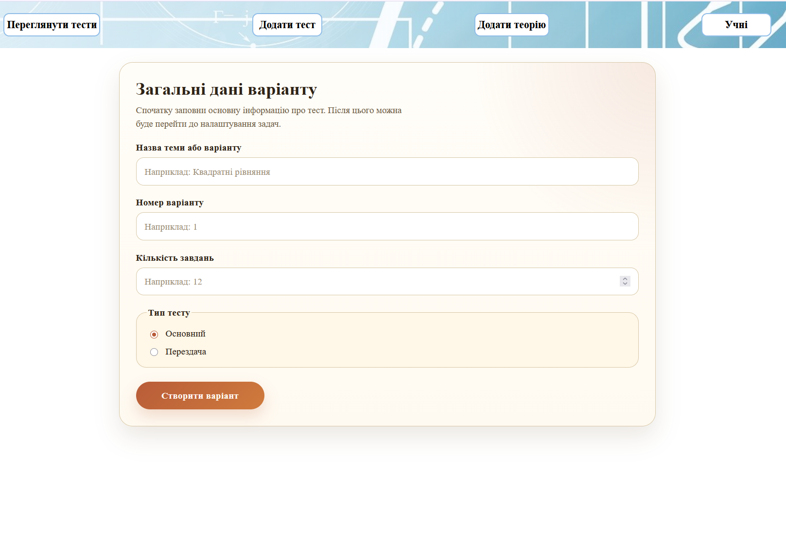
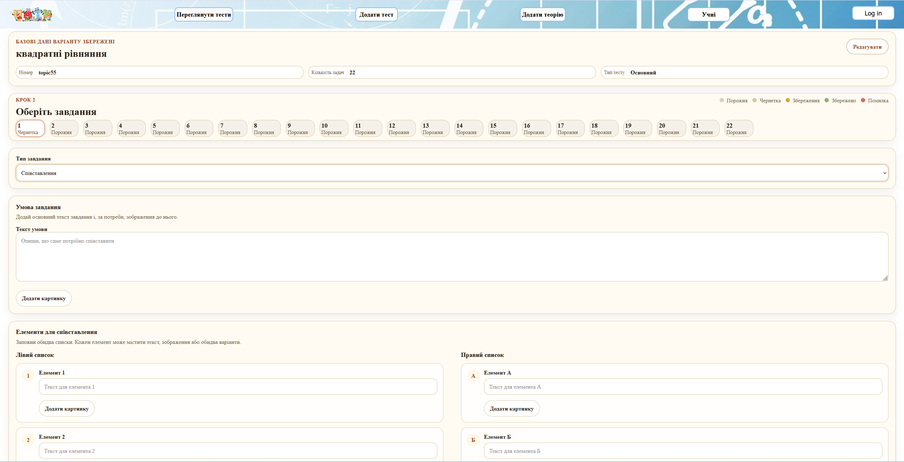
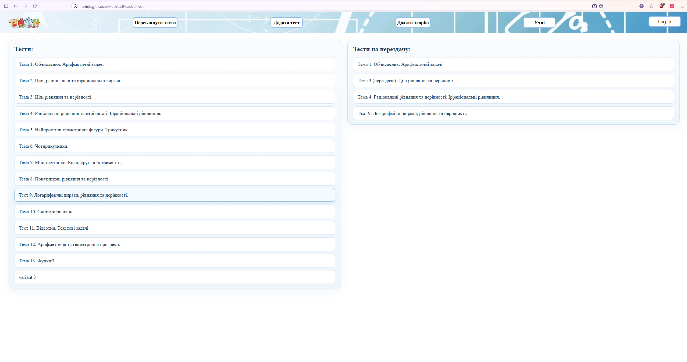
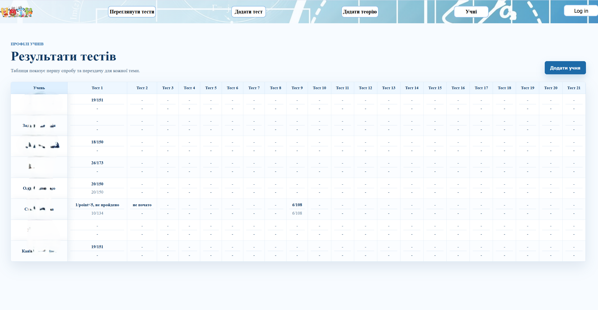

# Math Test Platform

Web application for creating and passing math tests.

## Demo

https://notmb.github.io/MathTestReact

## Features

- Create test variants
- One-time test links for students
- Save test results to Firestore
- Dynamic forms for answers
- Custom client-side routing (implemented without React Router)

## Tech Stack

- React
- TypeScript
- Firebase (Firestore, Storage)
- Vite

## Screenshots

### Create Test Variant

### Task Editor

### Variants List

### Student Results

